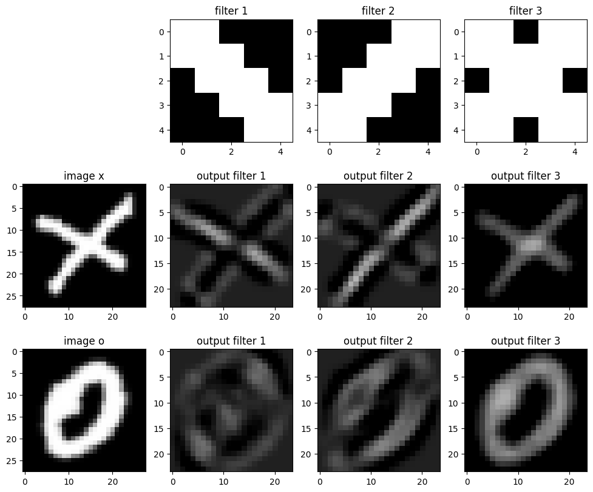
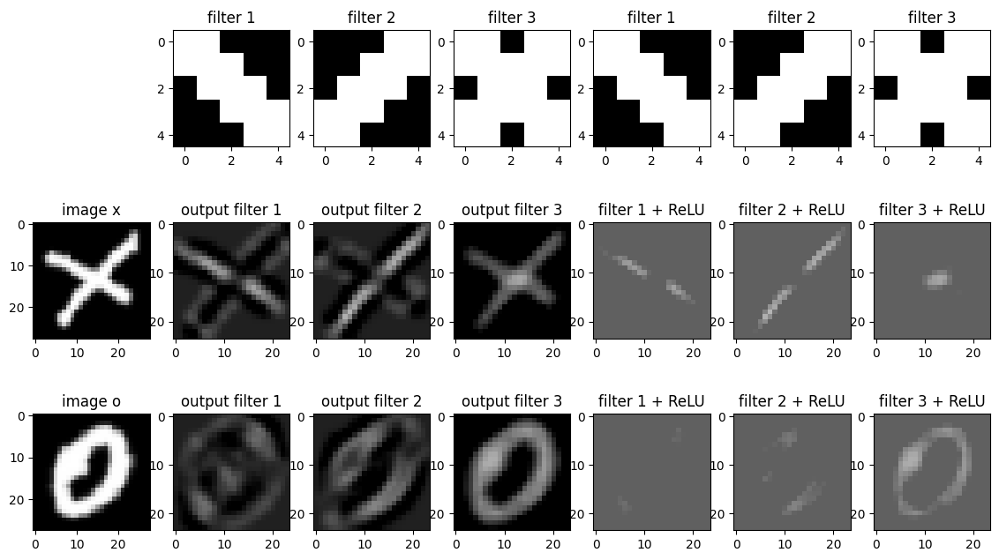
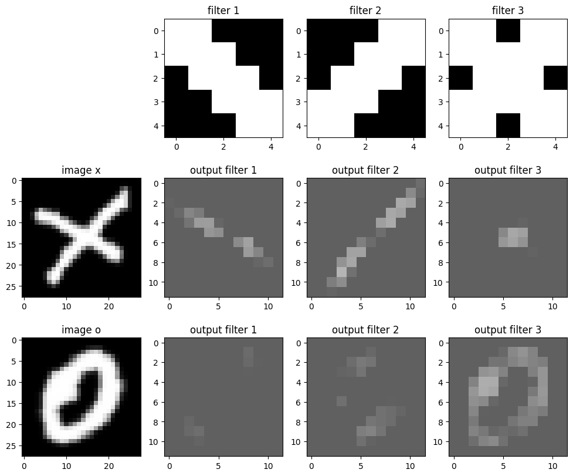

# CNN

Here we delve deeply in CNN parameters, methodology of training, confronting overfit, ...
For more detailed analysis and results, check out the notebook!
## EMNIST

### Introduction
* Importing libraries
* Helper functions
* Plotting functions
* Set seed and set device
* About Data

### A visualization of the process
#### Multiple filters
<p align="center">
    
</p>

#### ReLU
<p align="center">
    
</p>

#### MaxPooling
<p align="center">
    
</p>

### Implement a CNN
```
Results on the given `O` image:
Confidence of image being an 'O': 0.9998793601989746
Confidence of image being an 'X': 0.00012061846791766584
```

## FashionMNIST
