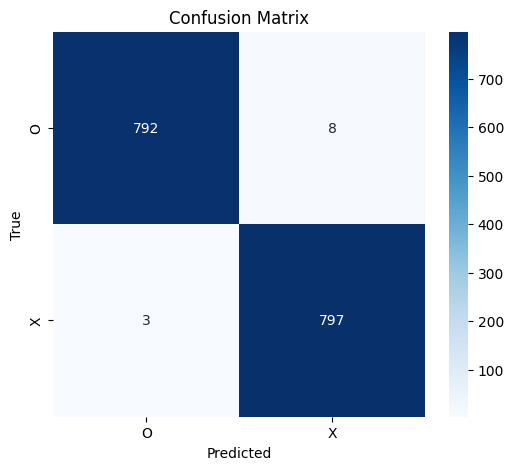
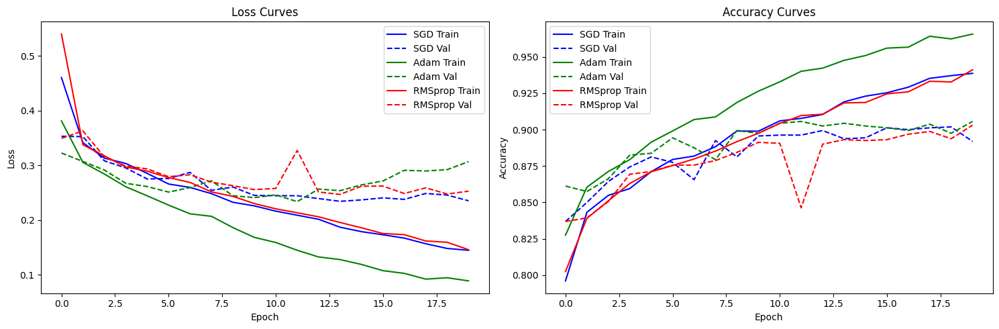

# CNN

Here we delve deeply in CNN parameters, methodology of training, confronting overfit, ...
For more detailed analysis and results, check out the notebook!
## EMNIST

### Introduction
* Importing libraries
* Helper functions
* Plotting functions
* Set seed and set device
* About Data

### A visualization of the process
#### Multiple filters
<p align="center">
    
</p>

#### ReLU
<p align="center">
    
</p>

#### MaxPooling
<p align="center">
    
</p>

### Implement a CNN
```
Results on the given `O` image:
Confidence of image being an 'O': 0.9998793601989746
Confidence of image being an 'X': 0.00012061846791766584
```

### Compare with a Fully Connected Network

Now let's train a simple fully connected neural network (MLP) on the same dataset. Compare its performance with your CNN in terms of accuracy, number of parameters, and training time.
```
CNN Accuracy: 99.31%
MLP Accuracy: 98.94%
```

### Add Evaluation Metrics
<p align="center">
    
</p>

### Compare Optimizers
Here we compare model performance when trained with SGD, Adam, and RMSProp. Plot the loss curves.
```
SGD Test Accuracy: 99.0
Adam Test Accuracy: 99.5625
RMSProp Test Accuracy: 99.5625
```

### Compare Activation Functions
Replace ReLU with Tanh or LeakyReLU.
```
Raw Network (ReLU): 99.31%
Tanh: 99.19%
LeakyReLU: 99.25%
```

### Train a Deeper CNN
Extend the network with your desired additional layers.
```
    Extended neural network with following structure:
    - Convolutional Layer 1: 1 → 32, kernel_size=3 + BatchNorm
    - Convolutional Block 2: 32 → 64, kernel_size=3 + BatchNorm + maxpooling
    - Convolutional Block 3: 64 → 128, kernel_size=3 + BatchNorm + maxpooling
    - Fully Connected Layer 1: 128 * 5 * 5 → 256
    - Fully Connected Layer 2: 256 → 128
    - Fully Connected Layer 3: 128 → 2
```
| **Metric**          | **Original Network** | **Extended Network** | **Improvement** |
|---------------------|----------------------|----------------------|-----------------|
| **Test Accuracy**   | 99.31%               | **99.56%**           | **+0.25%**      |
| **Final Loss**      | ~0.1 (estimated)     | **~0.05** (from plot)| **~50% lower**  |

---

## FashionMNIST

### Reugulariztion
**Techniques Applied(acc: 89.0% -> 86.25%):**

  - Architectural:

    - Dropout (both standard and spatial)

    - Batch Normalization (after each conv layer)

    - Weight Initialization (Xavier/Glorot)

  - Optimization:

    - AdamW optimizer (decoupled weight decay)

    - L2 Regularization (via weight_decay=1e-4)

    - Gradient Clipping (max_norm=1.0)

  - Training Process:

    - Learning Rate Scheduling (ReduceLROnPlateau)

    - Early Stopping (patience=5)

    - Implicit Label Smoothing (via CrossEntropyLoss)


### Data Augmentation
**Did the training accuracy reduce further compared to dropout alone**


**Yes!**
  - With data augmentation, the training accuracy is intentionally reduced because the model sees harder, more diverse examples.

  - This prevents it from memorizing patterns too quickly — a desirable regularization effect.

**Is the model still overfitting?**

**Most likely not!**

  - Training and validation curves are very close, especially in the accuracy plot.

  - Validation accuracy is stable and slightly higher than training accuracy in some epochs, which is common with augmentation (due to randomness).

  - This suggests little to no overfitting.

### BatchNorm Experiment
Let's replace the dropout layers with `BatchNorm2d` layers.Consequently compare performance, overfitting behavior, and convergence speed.
**Comparison: Dropout vs. BatchNorm**

| Aspect                  | **Dropout**           | **BatchNorm**         |
|-------------------------|------------------------|------------------------|
| **Test Accuracy**       | 89.0%                  | 89.0%                  |
| **Training Accuracy**   | Lower (~84–86%)        | Higher (~98%)         |
| **Validation Accuracy** | Peaks ~86%             | Peaks ~90%, but fluctuates |
| **Validation Loss**     | Steady ↓               | Initially ↓ but later ↑ |
| **Convergence Speed**   | Slower, gradual        | Faster, but unstable  |
| **Overfitting**         | Low to Moderate        | **High**              |
| **Generalization**      | More consistent        | Less consistent       |

### Early Stopping

We implement early stopping-> stop training if validation loss doesn't improve for 3 epochs.
```
Early stopping at epoch 16 — no improvement for 3 epochs.
Test accuracy is: 82.75%
```

### Try New Augmentations

How about experimenting with different augmentation strategies?
**Impacts**

| Technique               | Effect                                                                 |
|-------------------------|------------------------------------------------------------------------|
| **Mixup**             | Reduces overfitting, encourages smoother decision boundaries, but may reduce peak accuracy slightly |
| **Label Smoothing**   | Prevents overconfidence → improved generalization, but can soften class predictions |
| **LR Scheduler**      | Helped sustain gradual learning, reducing sharp loss drops             |
| **Gradient Clipping** | Prevents exploding gradients → helps keep training stable              |

### Compare Optimizers

Task: compare model performance when trained with SGD, Adam, and RMSProp.
<p align="center">
    
</p>